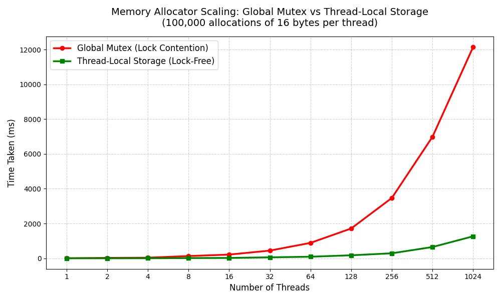
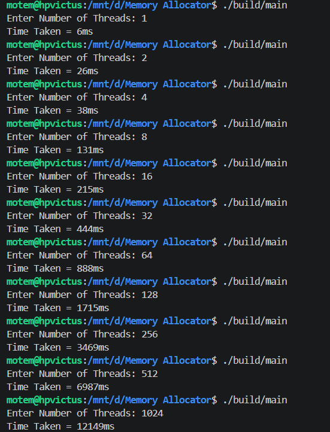
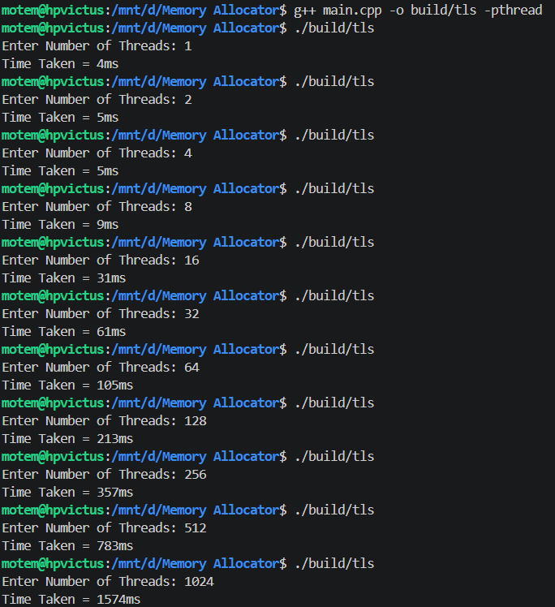

# Grab 

This repository contains a high-performance grab (custom memory allocator) and benchmark experiments to measure and resolve multi-threaded lock contention.

## What the experiment does

`main.cpp` runs a stress test to evaluate memory allocation scaling:
- Takes input: number of concurrent threads.
- Creates `n` threads.
- Each thread performs `100,000` allocations of `16` bytes using the custom allocator.
- Measures total elapsed time and prints it in milliseconds.

## Experiments & Benchmarks

The performance graph below highlights the dramatic difference between a globally locked allocator and a lock-free, thread-local architecture.



**Plot Observations:** 
As visualized in the graph above, the global mutex approach (red line) scales poorly. As the number of threads doubles, the time taken grows exponentially due to the increasing traffic jam of threads fighting for the lock. In contrast, the lock-free TLS approach (green line) scales incredibly efficiently, maintaining low latency and only showing significant time increases due to the sheer volume of raw allocations being processed, rather than waiting in line.

---

### 1. Global Lock Contention (Baseline)
The initial design used a standard `std::mutex` to ensure thread safety across a shared memory pool. 

**Observations:**
The benchmark demonstrates severe lock contention. When multiple threads attempt to allocate memory simultaneously, they are forced into a single-file queue. This results in massive CPU idle time (waiting for lock acquisition). At 1024 threads, the execution time spiked to **12,149ms** (over 12 seconds).



### 2. Thread-Local Storage (Zero-Lock Scalability)
**Reasoning:**
To eliminate the global lock bottleneck, the implementation was transitioned to use C++ `thread_local` storage. By providing every thread with its own isolated memory pool (`offset`) and segregated free list array, threads no longer share state. Because memory is not shared, data races are physically impossible, entirely bypassing the need for mutexes and the assembly instructions required to lock/unlock them.

**Observations:**
Removing the locks yielded massive performance gains. The lock-free concurrency model allowed 1024 threads to complete the exact same workload in just **1,267ms** a nearly **10x performance improvement** over the baseline.



---

## Allocator Architecture

The allocator implemented in `grab.hpp` features:
- **Segregated Free Lists:** Achieves strictly O(1) allocation and deallocation times using array-based size classes.
- **Memory Mapping:** Reserves memory pools directly from the OS using `mmap`.
- **Payload-Based Sizing:** Rounds block requests to 8-byte multiples. This intentionally trades minor internal fragmentation for strict memory alignment, simplified math, and ultra-low latency.
- **Concurrency Model:** Evolved from global mutex locking to lock-free, isolated memory pools per thread via `thread_local`.

## Files in this repo

- `main.cpp` — benchmark driver and timing logic.
- `grab.hpp` — custom memory allocator implementation.

## Build and run

Compile with a C++ compiler and pthread support, then run:

```bash
g++ main.cpp -o build/grab_test -pthread
./build/grab_test